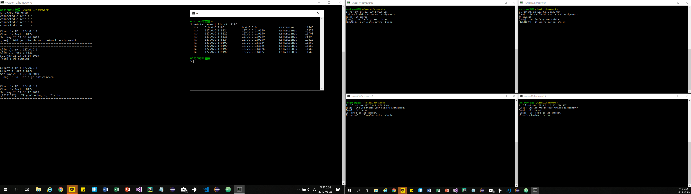

# chat_program
- 코드 소개

  - 소켓을 이용해 멀티 플랙싱, 멀티 쓰레드를 이용한 채팅 프로그램입니다.

  - Multi-Plexing

    - 서버 프로세스에서 여러 클라이언트 소켓을 연결합니다.
    - 이때 파일 디스크립터를 이용해 여러 클라이언트 소켓 연결을 관리합니다.
    - 서버에서 채팅입력을 받아 사용자의 이름과 메세지를 각 채팅방에 있는 클라이언트에게 전달합니다.
    - 

     

  - Multi-Thread

    - 쓰레드는 한 프로세스내에서 별도의 실행 흐름을 나타내는 단위이고 프로세스의 데이터 영역이 공유됩니다.
    - 이때 뮤텍스나 세마포어로 공동의 데이터 영역인 임계영역에 한번에 여러 쓰레드가 접근하지않도록 동기화합니다.
    - 여기에서는 채팅 서버에서 클라이언트의 요청이 왔을 때, 각 클라이언트를 처리하는 쓰레드를 생성합니다.
    - 그리고 클라이언트 소켓을 관리하는 변수를 전역변수로 선언되었기 때문에 쓰레드에서 다중접속이 가능합니다. 이를 임계영역으로 만들기 위해 mutex를 사용합니다.
    - 클라이언트에서는 메세지를 보내는 쓰레드와 메세지를 읽는 쓰레드를 이용해 채팅을 구현합니다.
    - 

  

- 사용 언어

  - C

- 관련 Skill

  - Computer Network
  - Socket programming
  - Cygwin

- 참고 서적
  - 윤성우 열혈 TCP/IP 소켓 프로그래밍([윤성우의 열혈 TCP/IP 소켓 프로그래밍(2010)(개정판 2판) - 교보문고 (kyobobook.co.kr)](http://www.kyobobook.co.kr/product/detailViewKor.laf?ejkGb=KOR&mallGb=KOR&barcode=9788996094036&orderClick=LEa&Kc=))
